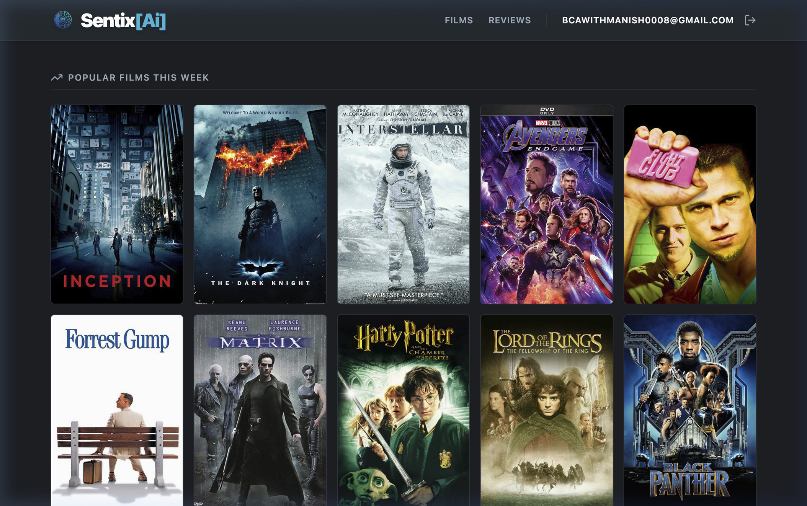
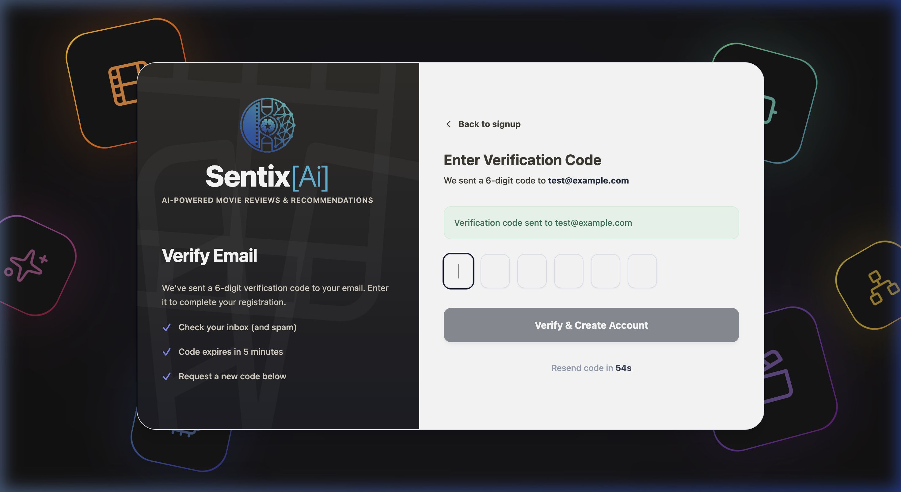
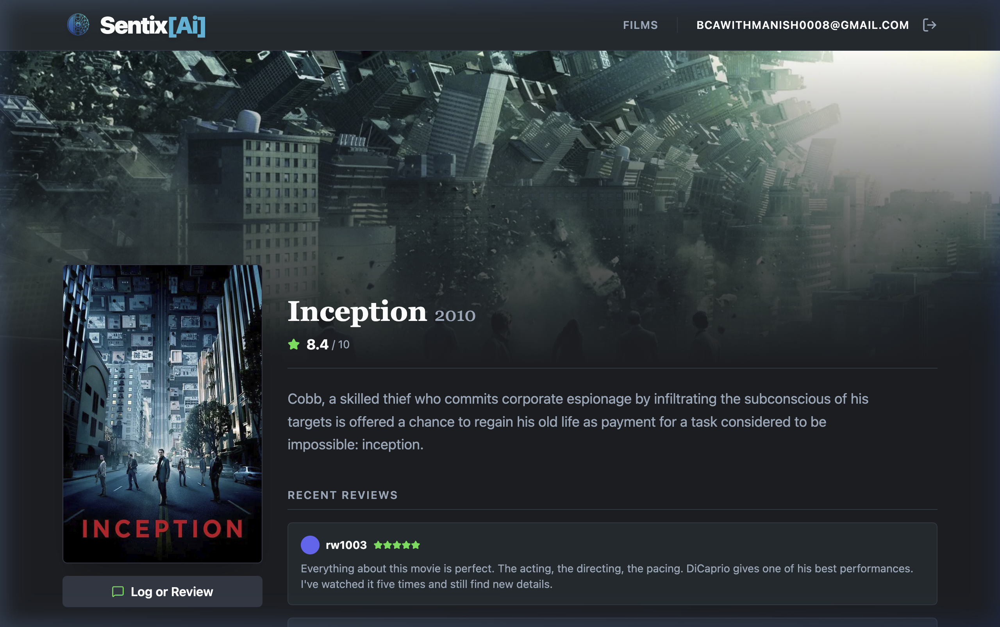
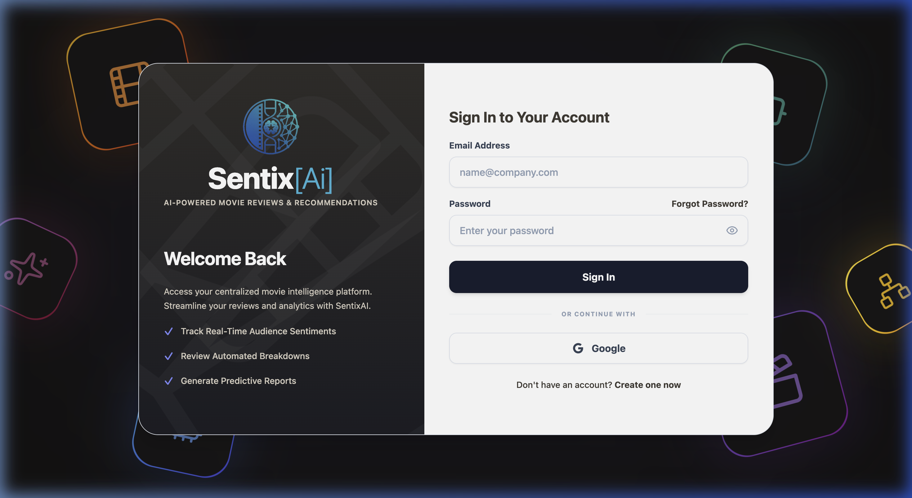
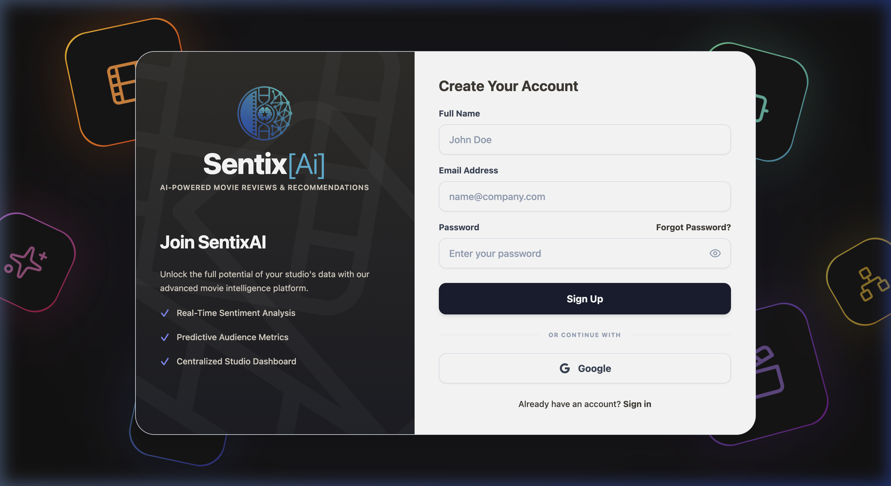

# SentixAi: AI-Powered Movie Review & Sentiment Analysis Platform

SentixAi is a modern, full-stack web application designed for film enthusiasts, analysts, and studios to track real-time audience sentiments. It ingests massive real-world movie review datasets and analyzes them using an embedded, local Artificial Intelligence NLP model.

---

## 📸 Platform Previews & Screenshots

### 🎬 Homepage & Movie Discovery


### 📊 Executive Analytics Dashboard


### 📽️ Movie Detail & Aspect Sentiment Analysis


### 🔒 Authentication & Security
| Login Screen | Signup & OTP Verification |
| :---: | :---: |
|  |  |

---

## ✨ Key Features

- **Local AI Sentiment Analysis**: Uses **DistilBERT** (`distilbert-base-uncased-finetuned-sst-2-english`) via Hugging Face's Transformers.js. Runs entirely on your local machine (zero API costs, complete privacy).
- **Real IMDB Data Ingestion**: Built-in pipeline to process and ingest a 50,000+ review IMDB dataset directly into the database.
- **Social Movie Discovery**: A Letterboxd-inspired UI where users can browse popular movies, read reviews, and see aggregate sentiment scores.
- **Executive Analytics Dashboard**: Visualizes sentiment distribution, total reviews processed, and AI-generated insights.
- **Ultra-Secure Authentication**: Combines **Firebase Auth** (Google Sign-In, Email/Password, and Phone OTP Verification).
- **Cloudinary Image Hosting**: Fast and reliable user profile picture storage using Cloudinary's unsigned upload presets.
- **Premium UI/UX**: Designed with a dark cinematic theme using React, Tailwind CSS, and a centralized theming system.

---

## 🏗️ Architecture & Tech Stack

### Frontend (`/frontend`)
- **Framework**: React 18 + Vite + TypeScript
- **Styling**: Tailwind CSS + Lucide Icons
- **Auth State**: Firebase Authentication SDK + React Context
- **Image Hosting**: Cloudinary (Direct browser uploads)
- **API Client**: Custom `fetchWithAuth` wrapper for secure backend communication

### Backend (`/backend`)
- **Framework**: Node.js + Express + TypeScript
- **Database**: MySQL/MariaDB (via XAMPP or native)
- **ORM**: Prisma (Type-safe database queries and migrations)
- **AI/ML Engine**: `@xenova/transformers` (DistilBERT loaded as a Singleton service)
- **Auth**: Firebase Admin SDK for JWT verification

---

## 🗄️ Database Schema

The relational database is managed via Prisma and includes core models:
- **User**: Managed alongside Firebase UIDs.
- **Movie**: Stores metadata and TMDB/IMDb identifiers.
- **Review**: Raw text and user ratings.
- **SentimentAnalysis**: 1-to-1 mapping with Reviews, stores AI confidence and Pos/Neg labels.
- **IngestionJob**: Tracks background dataset processing progress.

---

## 🚀 Getting Started

### Prerequisites
- Node.js (v18+)
- MySQL or MariaDB (via XAMPP or natively)
- Firebase Project configured for Authentication (Enable Email, Google, and Phone Sign-in. Make sure to configure the SMS Region Policy).
- Cloudinary Account (Requires Cloud Name and an Unsigned Upload Preset).

### Setup Instructions

1. **Clone the repository**
   ```bash
   git clone https://github.com/manishworkss/SentixAi.git
   cd SentixAi
   ```

2. **Setup Environment Variables**
   - In `frontend/.env`, configure your Firebase keys and Cloudinary endpoint/preset.
   - In `backend/.env`, configure your MySQL `DATABASE_URL` and `TMDB_API_KEY`.
   - In `backend/firebase-service-account.json`, add your Firebase Admin SDK private key JSON.

3. **Setup the Backend**
   ```bash
   cd backend
   npm install

   # Setup Prisma Database
   npx prisma generate
   npx prisma db push

   # Start the Express server on port 3001
   npm run dev
   ```

4. **Setup the Frontend**
   ```bash
   # In a new terminal
   cd frontend
   npm install
   # Start the Vite dev server
   npm run dev
   ```

5. **Access the App**
   Open your browser and navigate to `http://localhost:5173`.

## 🎨 Theme Configuration

To alter the aesthetics of the entire application, navigate to `/frontend/src/App.tsx` and modify the `Theme` constant at the top of the file. SentixAI handles everything from background tints to button hovers dynamically based on this object.

```typescript
export const Theme = {
  fontFamily: "font-sans",
  bgApp: "bg-[#EAE4D9]",     
  bgCard: "bg-[#F3EFE7]",    
  primary: "bg-[#3E3832]",
  // ...
};
```

---

## 🧠 How the AI Pipeline Works

1. **Ingestion**: The admin triggers an ingestion job. The backend reads the `IMDB Dataset.csv`, cleans the HTML tags, maps them to movies, and saves raw reviews in the database.
2. **Background Processing**: A non-blocking Node.js service continuously polls the database for unanalyzed reviews.
3. **Inference**: Reviews are fed into the DistilBERT model in batches of 50.
4. **Scoring**: The model returns POSITIVE/NEGATIVE labels and a confidence score (0 to 1).
5. **Storage & Dashboard**: Results are stored in the `SentimentAnalysis` table and immediately reflected on the frontend Analytics Dashboard.

---
*Developed for intelligent, AI-powered movie insights.*
