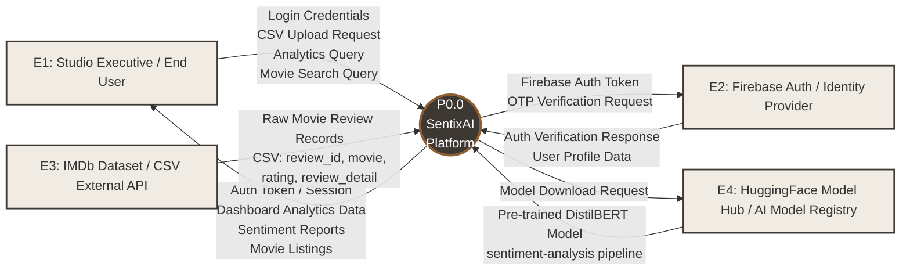
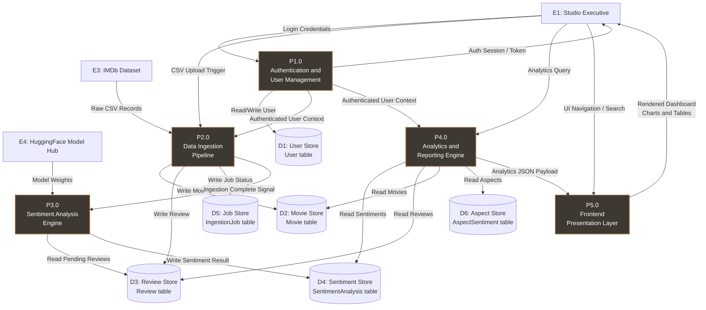
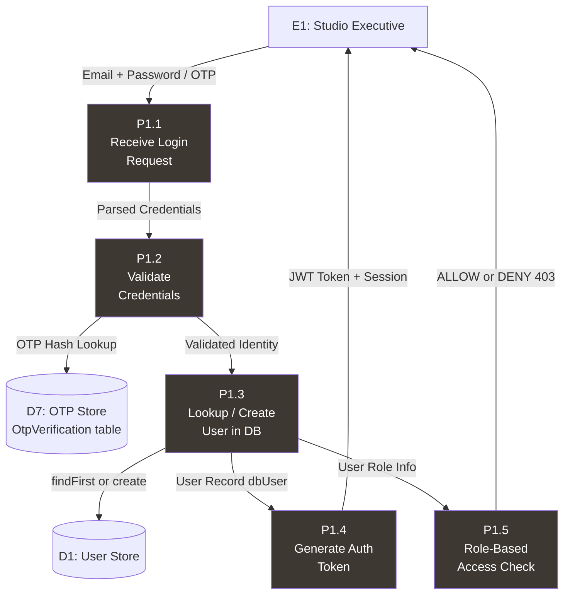
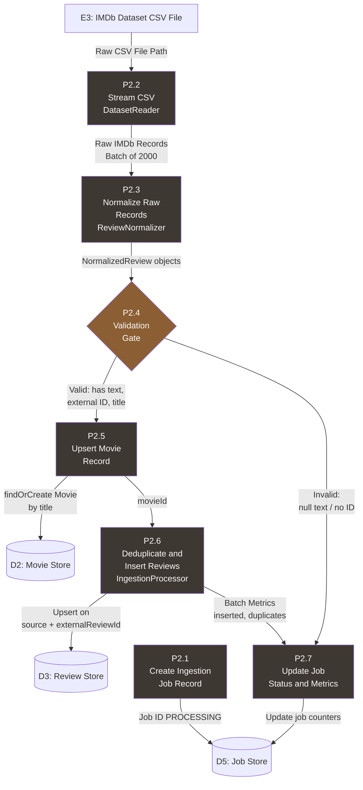
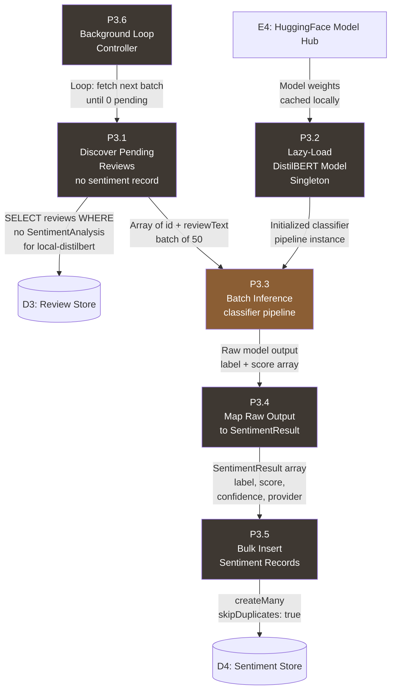
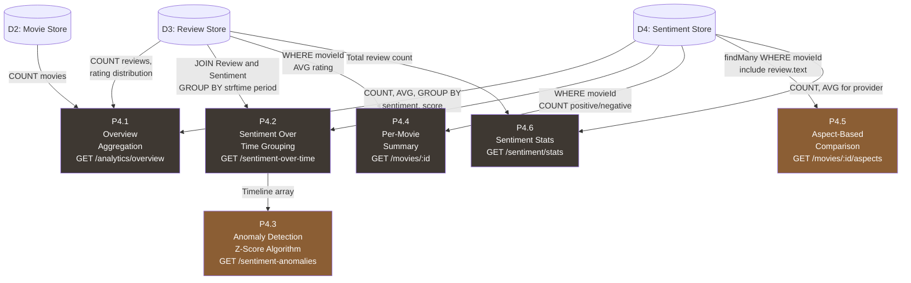
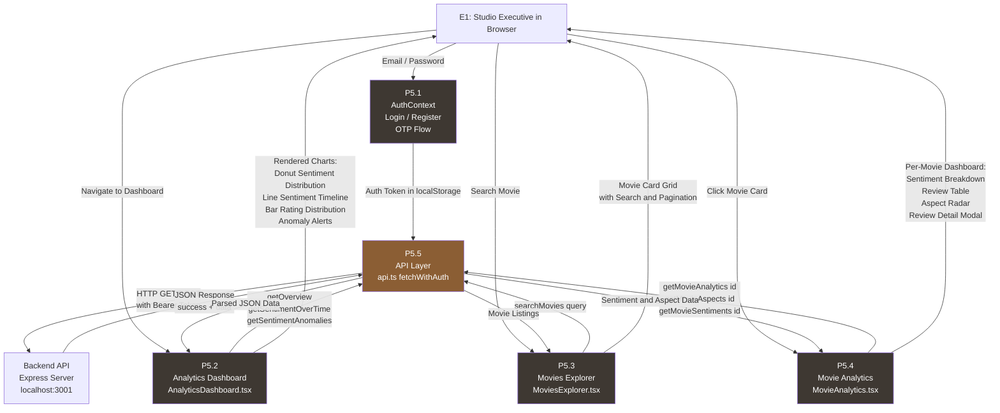

# ══════════════════════════════════════════════════════════════════════
# SentixAI Platform — Complete Data Flow Diagram (DFD) Document
# Version 4.2 Enterprise | BCA Semester 5, Parul University
# ══════════════════════════════════════════════════════════════════════

## Analyzing Unstructured Movie Review Feedback with Multi-Model AI

**Project:** SentixAI Platform (Version 4.2 Enterprise)  
**Domain:** Artificial Intelligence, NLP, Multi-Model Machine Learning  
**Submitted By:** ____________________________________  
**Roll No / Reg No:** ___________________________________  
**Guide Name:** ________________________________________  
**Date:** _____ / _____ / 2026

---

# 📋 TABLE OF CONTENTS

1. [Introduction to DFD](#1-introduction-to-dfd)
2. [Notation and Symbols Used](#2-notation-and-symbols-used)
3. [Level 0 — Context Diagram](#3-level-0--context-diagram)
4. [Level 1 — Major Subsystem Decomposition](#4-level-1--major-subsystem-decomposition)
5. [Level 2.1 — Authentication and User Management](#5-level-21--authentication-and-user-management)
6. [Level 2.2 — Data Ingestion Pipeline](#6-level-22--data-ingestion-pipeline)
7. [Level 2.3 — Sentiment Analysis Engine](#7-level-23--sentiment-analysis-engine)
8. [Level 2.4 — Analytics and Reporting Engine](#8-level-24--analytics-and-reporting-engine)
9. [Level 2.5 — Frontend Presentation Layer](#9-level-25--frontend-presentation-layer)
10. [Data Dictionary](#10-data-dictionary)
11. [Data Store Descriptions](#11-data-store-descriptions)
12. [External Entity Descriptions](#12-external-entity-descriptions)
13. [Process Descriptions Mini-Spec](#13-process-descriptions-mini-spec)

---

# 1. Introduction to DFD

A **Data Flow Diagram (DFD)** is a structured analysis tool that graphically represents the flow of data through an information system. It visualizes how data enters the system, how it is processed and transformed, where it is stored, and how it exits.

**Purpose of this document:**  
This DFD document provides a complete, multi-level decomposition of the **SentixAI Platform**, covering every subsystem from user authentication to AI-powered sentiment analysis and executive dashboard rendering. Each level progressively reveals more granular detail about the system's internal data transformations.

**Leveling Strategy:**

| Level | Scope | Description |
|:------|:------|:------------|
| **Level 0** | Context Diagram | Shows SentixAI as a single process with all external entities |
| **Level 1** | Major Subsystems | Decomposes SentixAI into 5 core subsystems |
| **Level 2.x** | Detailed Decomposition | Each Level 1 subsystem is further broken into granular processes |

---

# 2. Notation and Symbols Used

| Symbol | Meaning | Example |
|:-------|:--------|:--------|
| **Rectangle** | External Entity (source/sink of data) | Studio Executive, IMDb API |
| **Rounded Rectangle / Circle** | Process (transforms data) | P1.0 — Authenticate User |
| **Open Rectangle (parallel lines)** | Data Store | D1 — User Database |
| **Arrow** | Data Flow (with label) | Login Credentials |

**Naming Convention:**
- **Pn.m** — Process number (Level.Sub-process)
- **Dn** — Data Store number
- **En** — External Entity number

---

# 3. Level 0 — Context Diagram

The Context Diagram shows the **SentixAI Platform** as a single, monolithic process surrounded by all external entities that interact with it. This is the highest level of abstraction.



### Level 0 — Data Flow Summary Table

| No. | Data Flow | From | To | Description |
|:----|:----------|:-----|:---|:------------|
| DF-01 | Login Credentials | E1: Studio Executive | P0: SentixAI | Email + Password / OTP for authentication |
| DF-02 | Auth Token / Session | P0: SentixAI | E1: Studio Executive | JWT token or session for authorized access |
| DF-03 | CSV Upload Request | E1: Studio Executive | P0: SentixAI | Trigger to ingest IMDb dataset with maxRecords |
| DF-04 | Raw Movie Review Records | E3: IMDb Dataset | P0: SentixAI | CSV rows: review_id, movie, rating, review_detail, review_date |
| DF-05 | Dashboard Analytics Data | P0: SentixAI | E1: Studio Executive | Sentiment overview, timeline charts, anomaly alerts |
| DF-06 | Sentiment Reports | P0: SentixAI | E1: Studio Executive | Per-movie sentiment breakdown, aspect scores |
| DF-07 | Pre-trained DistilBERT Model | E4: HuggingFace | P0: SentixAI | ML model weights for local inference |
| DF-08 | Firebase Auth Response | E2: Firebase | P0: SentixAI | User identity verification result |

---

# 4. Level 1 — Major Subsystem Decomposition

Level 1 decomposes the monolithic SentixAI Platform process into **5 major subsystems** with their interconnecting data flows and shared data stores.



### Level 1 — Process Summary

| Process ID | Process Name | Input Data | Output Data | Data Stores Used |
|:-----------|:-------------|:-----------|:------------|:-----------------|
| P1.0 | Authentication and User Mgmt | Login Credentials, OTP | Auth Token, User Context | D1 (User) |
| P2.0 | Data Ingestion Pipeline | Raw CSV Records, Upload Trigger | Normalized Reviews, Movies | D2, D3, D5 |
| P3.0 | Sentiment Analysis Engine | Pending Reviews, Model Weights | Sentiment Scores | D3, D4 |
| P4.0 | Analytics and Reporting Engine | Sentiments, Reviews, Movies | Analytics JSON | D2, D3, D4, D6 |
| P5.0 | Frontend Presentation Layer | Analytics JSON, User Context | Rendered UI (Charts, Tables) | Client-side only |

---

# 5. Level 2.1 — Authentication and User Management

Decomposes **P1.0** into its internal sub-processes.



### Level 2.1 — Sub-Process Detail

| Process | Description | Implementation File |
|:--------|:------------|:-------------------|
| P1.1 | Receives raw login request from Express router | user.routes.ts |
| P1.2 | Validates OTP hash against stored hash, checks expiry and attempt count | auth.ts, OtpVerification model |
| P1.3 | Queries User table via Prisma findFirst, auto-creates mock user in dev mode if none exists | auth.ts requireAuth middleware |
| P1.4 | Issues JWT/session token for subsequent API calls via localStorage | Frontend AuthContext |
| P1.5 | requireRole middleware checks dbUser.role against allowed roles USER or ADMIN | auth.ts |

---

# 6. Level 2.2 — Data Ingestion Pipeline

Decomposes **P2.0** — the 7-stage movie review processing workflow.



### Level 2.2 — Sub-Process Detail

| Process | Description | Key Logic | Implementation File |
|:--------|:------------|:----------|:-------------------|
| P2.1 | Creates an IngestionJob record with status PROCESSING | db.ingestionJob.create | DatasetService.ts |
| P2.2 | Streams CSV file in batches of 2,000 records using Node.js streams | csv-parse streaming parser | DatasetReader.ts |
| P2.3 | Normalizes raw IMDb fields: strips HTML br tags, parses ratings 1-10, converts dates, resolves spoiler booleans | ReviewNormalizer.normalize | ReviewNormalizer.ts |
| P2.4 | Validation gate: discards records with empty text, missing review_id, or missing movie title | Returns null for invalid | ReviewNormalizer.ts |
| P2.5 | Finds or creates a Movie record using the movie title, assigns UUID | findFirst / create | IngestionProcessor.ts |
| P2.6 | Deduplicates reviews using composite unique key source+externalReviewId, inserts new reviews via createMany | skipDuplicates: true | IngestionProcessor.ts |
| P2.7 | Updates IngestionJob counters in real-time so UI can poll progress, sets final status to COMPLETED or FAILED | db.ingestionJob.update | DatasetService.ts |

### Data Transformation: Raw CSV to Normalized Review

| Raw CSV Field | Transformation | Normalized Field |
|:--------------|:---------------|:-----------------|
| review_id: "rw1234567" | Trim whitespace | externalId: "rw1234567" |
| movie: "Dune: Part Two" | Trim whitespace | movieTitle: "Dune: Part Two" |
| reviewer: "john_doe" | Trim, nullable | reviewer: "john_doe" |
| rating: "9" | Parse to Number, validate 1-10 | rating: 9 |
| review_date: "3 May 2024" | Date.parse to ISO DateTime | reviewDate: 2024-05-03T00:00:00 |
| spoiler_tag: "1" | Convert to Boolean | spoiler: true |
| review_detail: with br tags | Strip HTML, trim | text: cleaned text |
| helpful: "[15, 20]" | String conversion | helpfulVotes: "[15, 20]" |
| (none) | Auto-set | source: "IMDb Dataset" |

---

# 7. Level 2.3 — Sentiment Analysis Engine

Decomposes **P3.0** — the AI/ML core of SentixAI.



### Level 2.3 — Sub-Process Detail

| Process | Description | Implementation |
|:--------|:------------|:---------------|
| P3.1 | Queries Review table for records that have no matching SentimentAnalysis row where modelProvider equals local-distilbert | SentimentService.processPendingReviews |
| P3.2 | Singleton lazy-loader for the DistilBERT model. Downloads from HuggingFace on first call, then caches locally using xenova/transformers | TransformersProvider.loadModel |
| P3.3 | Runs batch inference using the sentiment-analysis pipeline. Processes array of review texts in parallel | TransformersProvider.analyzeBatch |
| P3.4 | Maps raw transformer output label POSITIVE score 0.95 to normalized SentimentResult with sign-adjusted score. NEGATIVE becomes -0.95 | TransformersProvider.mapToResult |
| P3.5 | Bulk inserts all sentiment results into SentimentAnalysis table. Uses composite unique key reviewId + modelProvider to prevent duplicates | SentimentService.processPendingReviews |
| P3.6 | Background async loop: repeatedly fetches batches of 50 pending reviews, processes them, yields event loop with 100ms delay, stops when 0 pending | SentimentService.startBackgroundProcessing |

### AI Model Pipeline Data Transformation

| Stage | Input | Output |
|:------|:------|:-------|
| Text Input | "The cinematography was breathtaking but the plot dragged badly" | Raw text string |
| Model Inference | Raw text | label: POSITIVE, score: 0.9876 |
| Score Mapping | Raw output | label: POSITIVE, score: +0.9876, confidence: 0.9876, provider: local-distilbert |

**Score Sign Convention:**
- POSITIVE: score = +confidence (e.g., +0.98)
- NEGATIVE: score = -confidence (e.g., -0.92)

---

# 8. Level 2.4 — Analytics and Reporting Engine

Decomposes **P4.0** — the intelligence layer.



### Level 2.4 — Analytics API Endpoint Map

| Process | API Endpoint | Input | Output | Algorithm |
|:--------|:-------------|:------|:-------|:----------|
| P4.1 | GET /api/analytics/overview | Auth token | totalReviews, analyzedReviews, positivePercentage, sentimentDistribution, ratingDistribution | Prisma count, aggregate, groupBy |
| P4.2 | GET /api/analytics/sentiment-over-time | groupBy=month | Array of period, totalReviews, positive, negative, averageScore | Raw SQL: strftime + GROUP BY period |
| P4.3 | GET /api/analytics/sentiment-anomalies | groupBy=month, threshold=2 | Array of period, sentimentScore, expectedScore, deviation, severity | Statistical Z-Score: z = (x - mean) / stddev |
| P4.4 | GET /api/analytics/movies/:movieId | movieId param | movie, reviewCount, positiveCount, negativeCount, positivePercentage | Prisma count with WHERE filter |
| P4.5 | GET /api/analytics/movies/:id/aspects | movieId param | Array of aspect, mentions, positive, negative, averageScore | Keyword-based aspect attribution across 8 categories |
| P4.6 | GET /api/sentiment/stats | Auth token | totalReviews, analyzedReviews, pendingReviews, progressPercentage, isProcessing | Prisma count and aggregate |

### Anomaly Detection Algorithm (P4.3)

```
INPUT:  timeline[] = [{period, averageScore}, ...]
OUTPUT: anomalies[] = [{period, sentimentScore, expectedScore, deviation, severity}]

1. Calculate Mean:         mean = SUM(averageScore) / N
2. Calculate Std Dev:      stddev = SQRT(SUM((score - mean)^2) / N)
3. For each data point:
   a. z-score = (score - mean) / stddev
   b. IF |z-score| >= threshold (default 2.0):
      Flag as ANOMALY
      severity = z > 0 ? HIGH_POSITIVE : HIGH_NEGATIVE
4. Return only flagged anomalies
```

### Aspect-Based Sentiment Analysis Keywords (P4.5)

| Aspect | Detection Keywords |
|:-------|:-------------------|
| **Acting** | acting, actor, actress, cast, performance, played by |
| **Story** | story, plot, script, writing |
| **Direction** | director, direction, directed |
| **Visuals** | visuals, cinematography, camera, shot, lighting |
| **Music** | music, soundtrack, score, song, audio |
| **Characters** | character, protagonist, villain |
| **Pacing** | pacing, pace, slow, fast, dragged |
| **Effects** | effects, cgi, vfx, special effects |

---

# 9. Level 2.5 — Frontend Presentation Layer

Decomposes **P5.0** — the React/Vite client application.



### Level 2.5 — Frontend Component Map

| Component | File | API Calls | UI Elements |
|:----------|:-----|:----------|:------------|
| P5.1 AuthContext | contexts/AuthContext.tsx | /api/users/register, /api/users/login | Login form, OTP input, Register form |
| P5.2 Analytics Dashboard | components/AnalyticsDashboard.tsx | getOverview, getSentimentOverTime, getSentimentAnomalies | Donut chart, line chart, bar chart, anomaly alerts |
| P5.3 Movies Explorer | components/MoviesExplorer.tsx | searchMovies query | Search bar, movie card grid, pagination |
| P5.4 Movie Analytics | components/MovieAnalytics.tsx | getMovieAnalytics id, getMovieAspects id, getMovieSentiments id | Sentiment stats, aspect bars, review table, modal |
| P5.5 API Layer | api.ts | All HTTP calls with fetchWithAuth | N/A - data transport layer |

---

# 10. Data Dictionary

Complete data dictionary for all data elements flowing through SentixAI.

| Data Element | Type | Format | Constraints | Used In |
|:-------------|:-----|:-------|:------------|:--------|
| userId | String | UUID v4 | Primary Key, unique | D1 |
| email | String | name@domain.com | Unique, required | D1, DF-01 |
| firebaseUid | String | Alphanumeric | Unique, required | D1 |
| role | String | USER or ADMIN | Default: USER | D1 |
| status | String | ACTIVE or SUSPENDED | Default: ACTIVE | D1 |
| movieId | String | UUID v4 | Primary Key | D2 |
| imdbId | String | tt + digits | Unique, optional | D2 |
| title | String | Free text | Required, indexed | D2 |
| reviewId | String | UUID v4 | Primary Key | D3 |
| externalReviewId | String | rw + digits | Composite unique with source | D3 |
| reviewText | String | Free text | Required, non-empty | D3 |
| rating | Integer | 1 to 10 | Nullable | D3 |
| reviewDate | DateTime | ISO 8601 | Nullable | D3 |
| source | String | IMDB or METACRITIC | Default: IMDB | D3 |
| sentiment | String | POSITIVE or NEGATIVE or NEUTRAL | Required | D4 |
| score | Float | -1.0 to +1.0 | Required | D4 |
| confidence | Float | 0.0 to 1.0 | Nullable | D4 |
| modelProvider | String | local-distilbert | Required | D4 |
| jobStatus | String | PENDING or PROCESSING or COMPLETED or FAILED | Default: PENDING | D5 |
| processedRecords | Integer | 0 to N | Default: 0 | D5 |
| insertedReviews | Integer | 0 to N | Default: 0 | D5 |
| otpHash | String | bcrypt hash | Required | D7 |
| attempts | Integer | 0 to 5 | Default: 0, max 5 | D7 |

---

# 11. Data Store Descriptions

| Store ID | Store Name | Database Table | Description | Primary Key | Key Relationships |
|:---------|:-----------|:---------------|:------------|:------------|:-------------------|
| D1 | User Store | User | Stores registered platform users with Firebase UID mapping | id UUID | Referenced by auth middleware |
| D2 | Movie Store | Movie | Stores unique movie records with IMDb ID and metadata | id UUID | 1:N to Review, 1:N to IngestionJob |
| D3 | Review Store | Review | Stores normalized movie reviews from all sources | id UUID | N:1 to Movie, 1:N to SentimentAnalysis |
| D4 | Sentiment Store | SentimentAnalysis | Stores AI-generated sentiment results per review per model | id UUID | N:1 to Review. Unique: reviewId + modelProvider |
| D5 | Job Store | IngestionJob | Tracks dataset ingestion job progress and status | id UUID | N:1 to Movie optional |
| D6 | Aspect Store | AspectSentiment | Stores aspect-level sentiment scores per review | id UUID | N:1 to Review, N:1 to Aspect |
| D7 | OTP Store | OtpVerification | Temporary OTP verification codes for email auth | id UUID | Unique: email |

---

# 12. External Entity Descriptions

| Entity ID | Entity Name | Type | Description | Data Exchanged |
|:----------|:-----------|:-----|:------------|:---------------|
| E1 | Studio Executive / End User | Human Actor | The primary user who uploads datasets, views dashboards, and analyzes movie sentiment | Login credentials, CSV upload triggers, analytics queries, rendered UI |
| E2 | Firebase Authentication | External Service | Google identity platform providing OTP-based and email/password authentication | Auth tokens, user profile data, verification responses |
| E3 | IMDb Dataset | External Data Source | CSV dataset containing 50,000+ raw movie reviews from IMDb with fields: review_id, movie, rating, review_detail | Raw CSV records |
| E4 | HuggingFace Model Hub | External Service | Model registry hosting pre-trained transformer models. SentixAI uses Xenova/distilbert-base-uncased-finetuned-sst-2-english | Pre-trained model weights in ONNX format |

---

# 13. Process Descriptions Mini-Spec

## P1.0 — Authentication and User Management
**Purpose:** Validates user identity and establishes authorized session context for all API requests.  
**Trigger:** HTTP request to any protected endpoint via requireAuth middleware.  
**Logic:**  
1. Extract Bearer token from Authorization header  
2. Look up first user in database via db.user.findFirst  
3. If no user exists: auto-create mock user for development  
4. If user status is INACTIVE: return 403  
5. Attach dbUser to Express req object and call next  

## P2.0 — Data Ingestion Pipeline
**Purpose:** Ingests, normalizes, validates, deduplicates, and stores raw movie reviews from CSV datasets into the relational database.  
**Trigger:** POST /api/ingestion/imdb with maxRecords parameter.  
**Logic:**  
1. Create IngestionJob record with status PROCESSING  
2. Open CSV file stream and process in batches of 2,000  
3. For each batch: normalize fields, validate, find/create Movie, deduplicate, bulk insert Reviews  
4. Update job counters after each batch for real-time progress tracking  
5. On completion: set status COMPLETED. On error: set status FAILED with error message  

## P3.0 — Sentiment Analysis Engine
**Purpose:** Runs AI-powered sentiment classification on all unanalyzed reviews using a local DistilBERT transformer model.  
**Trigger:** POST /api/sentiment/analyze or background processing loop.  
**Logic:**  
1. Query reviews with no matching SentimentAnalysis for local-distilbert  
2. Lazy-load DistilBERT model via singleton pattern, cached after first download  
3. Run batch inference on review texts  
4. Map model output to signed score: POSITIVE to +confidence, NEGATIVE to -confidence  
5. Bulk insert results with skipDuplicates: true  
6. Repeat until 0 pending reviews remain  

## P4.0 — Analytics and Reporting Engine
**Purpose:** Aggregates stored sentiment data into actionable intelligence metrics including time series, anomaly detection, and aspect-based analysis.  
**Trigger:** HTTP GET requests to analytics endpoints.  
**Logic:**  
1. Overview: Count total/analyzed/pending reviews, calculate positive/negative percentages, aggregate rating distribution  
2. Timeline: Group sentiments by time period using strftime, calculate per-period averages  
3. Anomalies: Compute mean and standard deviation across timeline, flag data points where z-score exceeds threshold  
4. Aspects: Keyword-match review text against 8 cinematic aspect categories, compute per-aspect sentiment scores  

## P5.0 — Frontend Presentation Layer
**Purpose:** Provides an interactive, real-time analytics dashboard rendered in the user browser.  
**Trigger:** User navigation to http://localhost:5174.  
**Logic:**  
1. AuthContext manages login/register flow and stores token in localStorage  
2. All API calls go through fetchWithAuth which injects Bearer token  
3. Dashboard renders sentiment distribution, timeline charts, and anomaly alerts  
4. Movie explorer provides search and pagination  
5. Per-movie view shows detailed sentiment breakdown, aspect comparison, and review table with modal  

---

> **End of DFD Document — SentixAI Platform v4.2 Enterprise**
