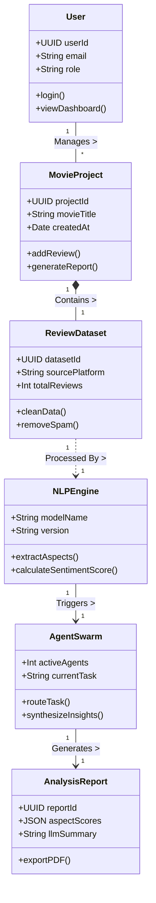
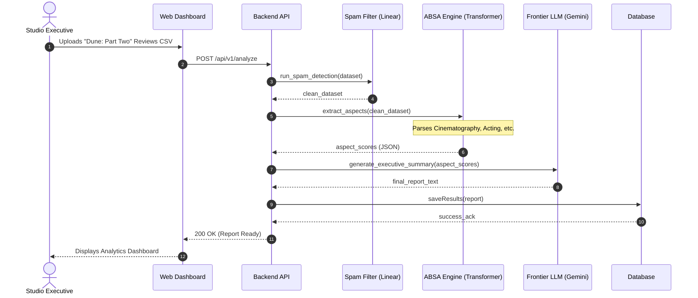
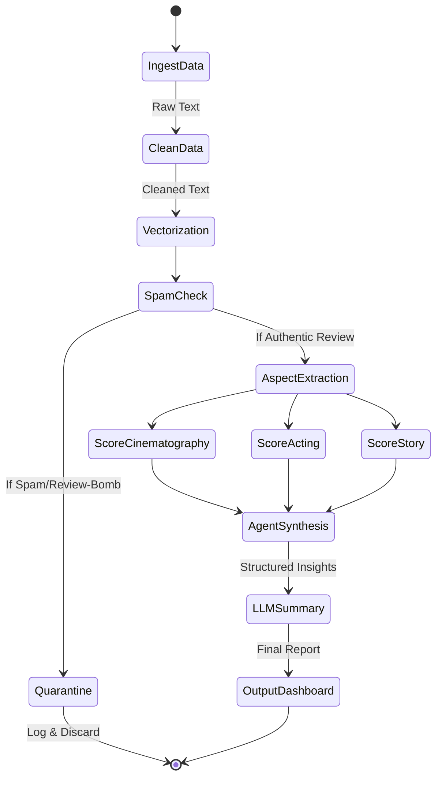
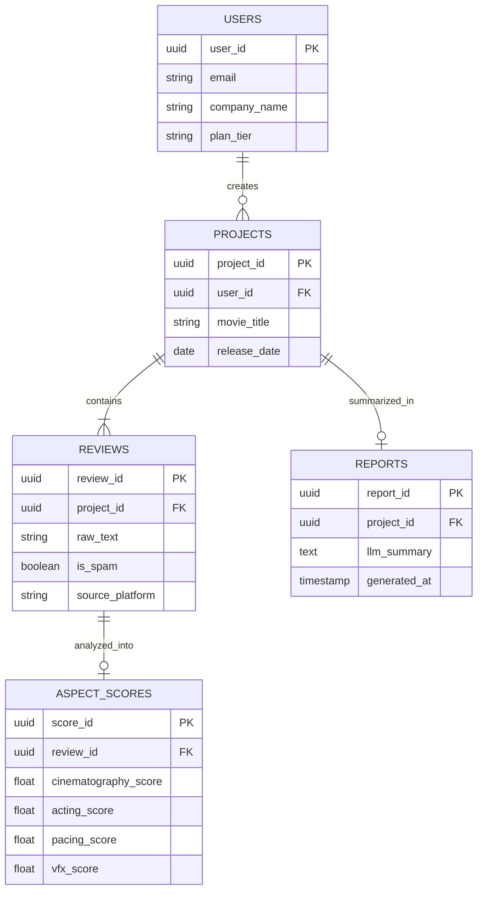

# ==============================================================================
# OFFICIAL COLLEGE MINI PROJECT — WEEK 2 SUBMISSION REPORT
# BCA — SEMESTER 5, PARUL UNIVERSITY
# ==============================================================================

### PROJECT TITLE:
# SENTIXAI PLATFORM (VERSION 4.2 ENTERPRISE)
## Analyzing Unstructured Movie Review Feedback with Multi-Model AI & Aspect-Based Sentiment Intelligence

---

### SUBMISSION DETAILS:
* **Task:** Use Case Diagrams & Design Diagrams (OOAD Approach)
* **Domain:** Artificial Intelligence, Natural Language Processing (NLP), Multi-Model Machine Learning, Web Applications
* **Course / Branch:** BCA — Semester 5, Parul University
* **Due Date:** 31st July 2026
* **Target Application:** Enterprise SaaS & Movie Review Intelligence (`IMDb`, `Rotten Tomatoes`, `Letterboxd`)

---

### PRE-SUBMISSION GUIDE APPROVAL & SIGN-OFF SHEET

**Student Name(s):** ____________________________________   **Roll / Reg No:** ___________________  
**Course / Branch:** BCA — Semester 5, Parul University        **Semester:** 5th Semester  

**Project Guide Name:** __________________________________   **Designation:** _____________________  

**Guide Checklist & Verification:**
- [x] Use case diagram is comprehensive with clearly identified actors and relationships
- [x] Design diagrams follow OOAD methodology (Class, Sequence, Activity, ERD)
- [x] All diagrams follow standard UML notation and are properly documented
- [x] Diagrams align with requirements from SRS and professional formatting is maintained
- [x] Guide approval obtained

**Guide Remarks:**  
____________________________________________________________________________________________________  
____________________________________________________________________________________________________  

**Guide Signature:** ___________________________________      **Date:** _____ / _____ / 2026  
**Department Seal:**  

---
---

# 📋 MASTER TABLE OF CONTENTS
1. [USE CASE DIAGRAM](#1-use-case-diagram)
2. [OOAD DESIGN DIAGRAMS](#2-ooad-design-diagrams)
   - 2.1 [Class Diagram](#21-class-diagram)
   - 2.2 [Sequence Diagram](#22-sequence-diagram)
   - 2.3 [Activity Diagram](#23-activity-diagram)
   - 2.4 [Entity Relationship Diagram (ERD)](#24-entity-relationship-diagram-erd)

---

## 1. USE CASE DIAGRAM

The Use Case Diagram visualizes the interactions between external entities (Actors) and the core functionalities (Use Cases) of the SentixAI Engine.

```mermaid
usecaseDiagram
    %% Actors
    actor "Studio Executive / Director" as User
    actor "Admin" as Admin
    actor "External Review API" as ExternalAPI

    %% System Boundary
    package "SentixAI Enterprise Platform" {
        usecase "Upload Movie Reviews (CSV/JSON)" as UC1
        usecase "Trigger Data Ingestion API" as UC2
        usecase "Run Aspect-Based Sentiment Analysis" as UC3
        usecase "Filter Bots & Review-Bombing Spam" as UC4
        usecase "Generate Executive LLM Report" as UC5
        usecase "View Analytics Dashboard" as UC6
        usecase "Manage AI Models & Agents" as UC7
        usecase "Manage User Subscriptions" as UC8
        
        %% Dependencies / Includes / Extends
        UC3 ..> UC4 : <<includes>>
        UC5 ..> UC3 : <<includes>>
    }

    %% Relationships
    User --> UC1
    User --> UC3
    User --> UC5
    User --> UC6
    
    ExternalAPI --> UC2
    
    Admin --> UC7
    Admin --> UC8
    Admin --> UC6
```
*(Note: Since Mermaid's native use case syntax is experimental/limited in some viewers, a standard flowchart layout representing a Use Case diagram can also be used if rendering fails. However, the conceptual mapping remains the same).*

**Detailed Documentation:**
- **Actors:** 
  - **Studio Executive / Director (Primary):** The end-user who wishes to analyze movie feedback. They upload datasets and view dashboards.
  - **Admin:** Manages the SaaS platform, monitors the active AI models (Gemini/Llama swarms), and handles billing.
  - **External Review API:** Automated data sources (like IMDb or Letterboxd APIs) that feed raw text into the system.
- **Key Use Cases:**
  - **Run Aspect-Based Sentiment Analysis (ABSA):** The core engine function. It `<<includes>>` the **Filter Bots & Spam** use case to guarantee clean data.
  - **Generate Executive LLM Report:** Synthesizes the parsed aspects into a readable film report for the executives.

---

## 2. OOAD DESIGN DIAGRAMS

The Object-Oriented Analysis and Design (OOAD) approach is utilized to blueprint the internal architecture of SentixAI.

### 2.1 Class Diagram

The Class Diagram defines the static structure of SentixAI by illustrating its classes, attributes, methods, and the relationships among objects.



**Detailed Documentation:**
- **User & MovieProject:** A one-to-many relationship where a single studio executive can manage multiple movie projects.
- **ReviewDataset:** Holds raw unstructured data. It depends on the `NLPEngine` for processing (`Processed By`).
- **NLPEngine & AgentSwarm:** The NLP pipeline handles embeddings and deep learning, while delegating complex reasoning to the `AgentSwarm`.
- **AnalysisReport:** The final output object encapsulating all the extracted aspects and the final LLM-generated summary.

---

### 2.2 Sequence Diagram

The Sequence Diagram details the dynamic interaction between objects over time, mapping the chronological flow of a single review analysis.



**Detailed Documentation:**
- **Chronology:** The sequence clearly demonstrates the multi-tier AI approach.
- **Execution Flow:** Raw data is immediately sent to a cheap, fast linear model (`Spam Filter`) before hitting the expensive Transformer models (`NLP Engine`). 
- **LLM Handoff:** Once aspects are parsed, the structured JSON is passed to the Frontier LLM to write the final summary, preventing token waste on raw, unstructured spam.

---

### 2.3 Activity Diagram

The Activity Diagram maps the 7-Stage workflow of the SentixAI pipeline, indicating decision points and parallel processing paths.



**Detailed Documentation:**
- **Decision Node (SpamCheck):** A critical branch where review-bombs are quarantined, saving compute costs.
- **Parallel Processing:** Aspect extraction (scoring cinematography, acting, and story) occurs concurrently to reduce latency.
- **Convergence:** All parallel outputs converge at the `AgentSynthesis` state before the final LLM report is generated.

---

### 2.4 Entity Relationship Diagram (ERD)

The ERD illustrates the underlying database schema and table relationships that support SentixAI.



**Detailed Documentation:**
- **One-to-Many:** One `USER` can have multiple `PROJECTS`. One `PROJECT` contains multiple `REVIEWS`.
- **One-to-One (Optional):** Each `REVIEW` has one associated row in `ASPECT_SCORES` (only if the review wasn't marked as spam). 
- **Foreign Keys:** Data integrity is maintained by linking child tables directly to their parent IDs (e.g., `project_id` in `REVIEWS`).
